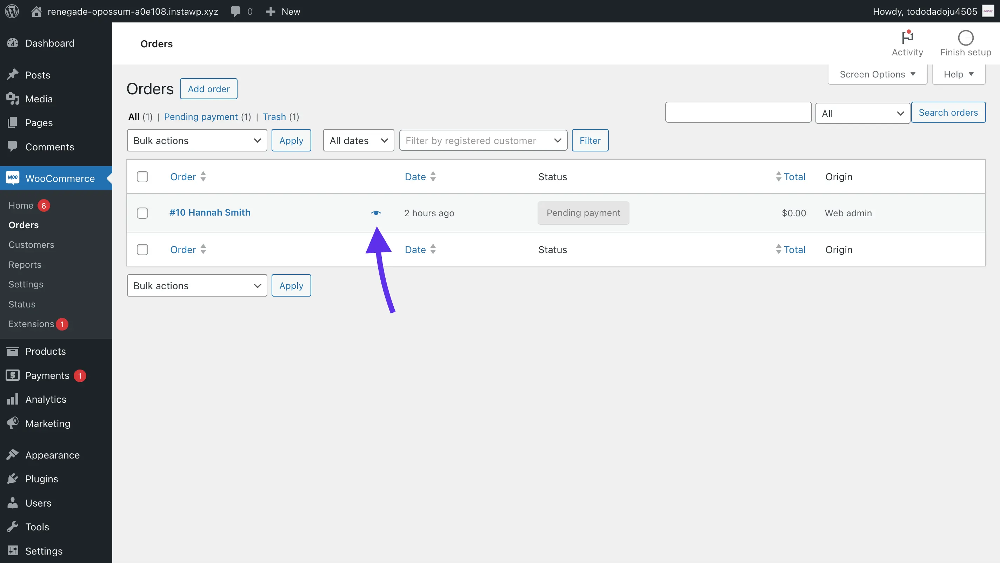
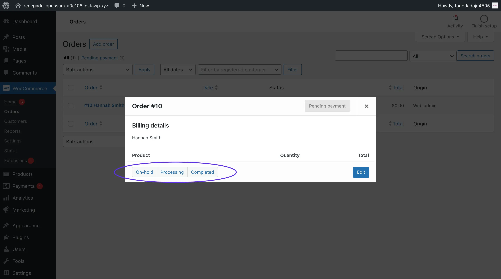
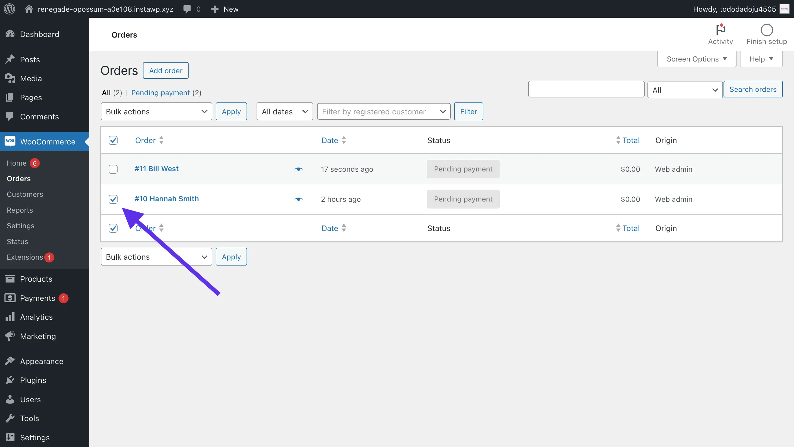
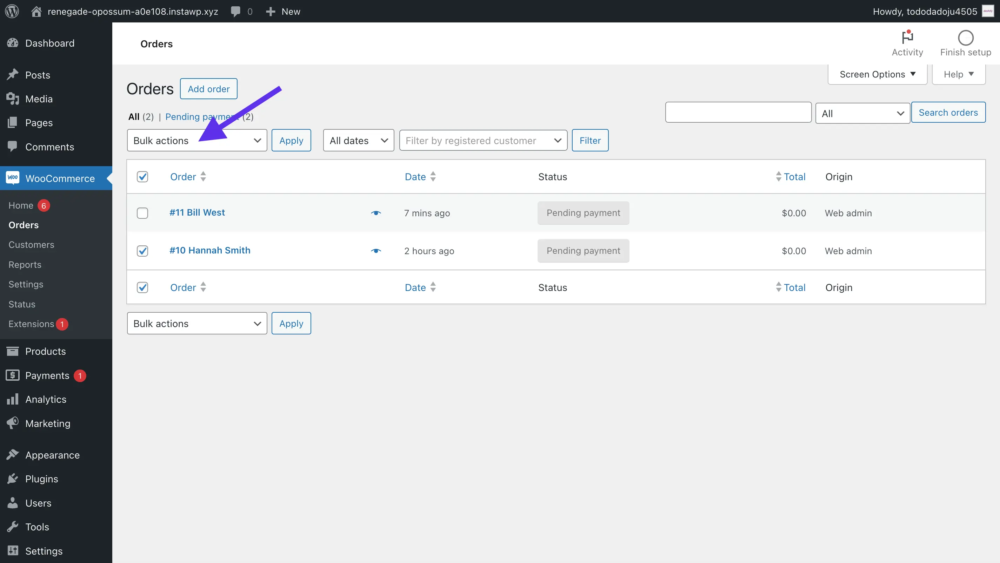
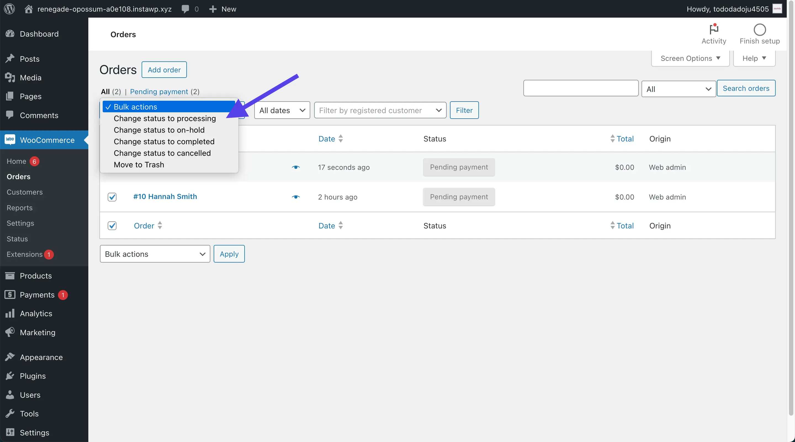
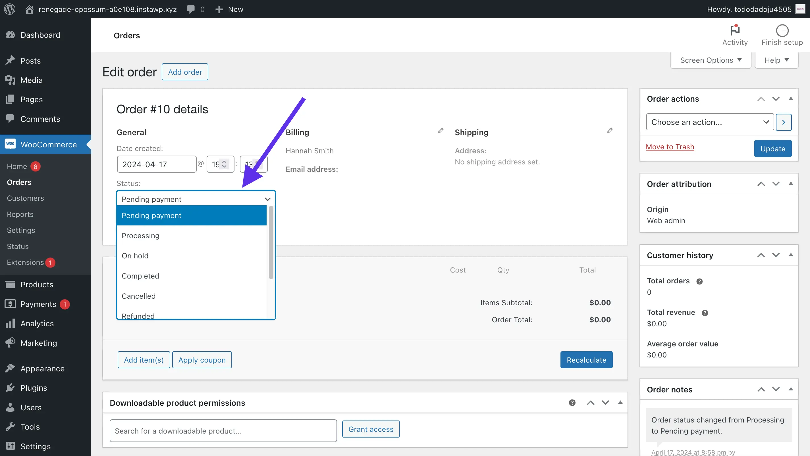

+++
title = 'Change order status in WooCommerce'
slug = 'change-order-status-in-woocommerce'
date = '2024-04-17'
draft = false
summary = 'All the ways you can manually change the order status of an order in WooCommerce. This is a beginner tutorial, and no other plugins downloads are required.'
+++



	<h2 class="text-gray-50" style="margin-top: 0; margin-bottom: 0.6rem;">Summary</h2>
	
This is a simple, easy-to-follow guide on all the ways you, as a merchant, can manually change the order status of an order in WooCommerce. This guide doesn’t require you to download any plugins or write any code. We show how to change the order status in a standard WooCommerce install.

	
In this guide, you’ll learn how to:

	<ul class="list-disc ml-8 my-3 leading-7">
		<li><a href="#change-order-status-from-the-order-list" class="text-gray-50">Change order status from the order list</a></li>
		<li><a href="#change-order-status-from-the-order-edit-view" class="text-gray-50">Change order status from the order edit view</a></li>
	</ul>



## Change order status from the order list

### Using the order preview

Each order in the order list has an **eye icon** next to the name on the order, that when clicked, opens a preview of the order details. Here you can change the order status with a single click. What order statuses are available depends on the current status of the order.

If you don’t see the order status you wish to change the order to, you can always click **Edit** and change the order status from there.

### Using bulk actions

Another option for changing the status of a single or multiple orders is to **check the boxes** next to the orders you wish to change. Then, click **Bulk actions** and select the order status to change all the selected orders to.

## Change order status from the order edit view

If you click into an order from the order list, you’ll go into the order edit view. From the order details area, you can change the status using the dropdown under the label **Status**.

## Conclusion

These are the three ways to manually change an order’s status in WooCommerce. I hope this helps you in learning WooCommerce!
