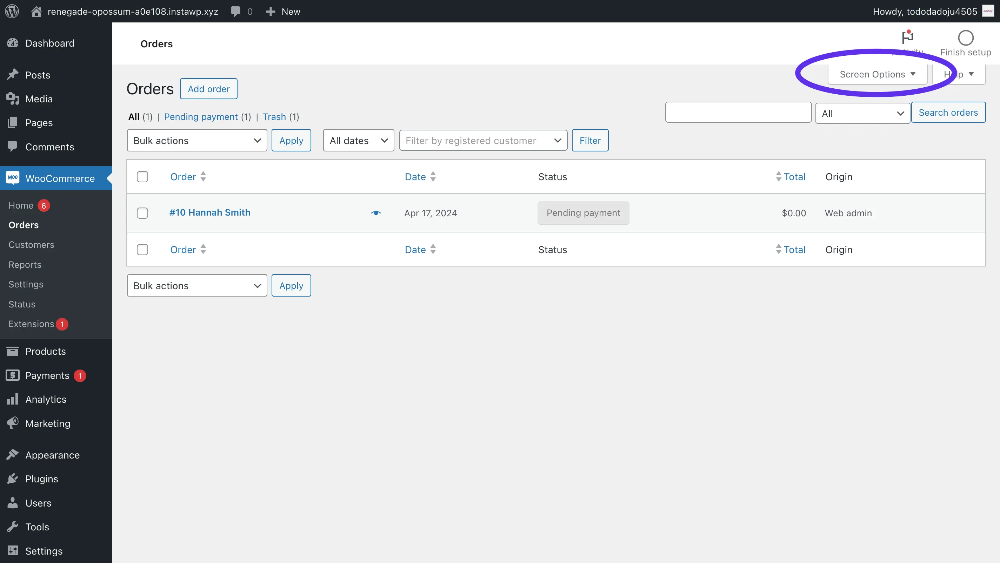
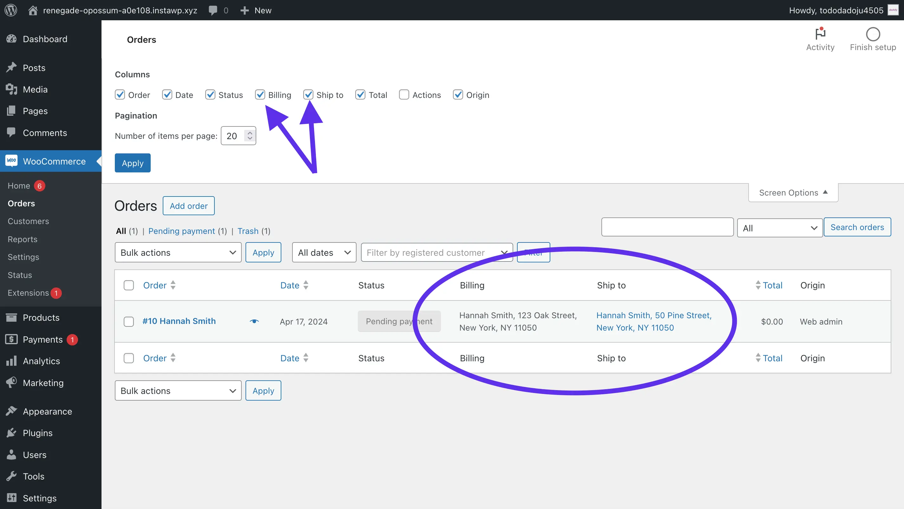

+++
title = 'Show billing and shipping addresses in the WooCommerce order list'
slug = 'show-billing-shipping-in-woocommerce-order-list'
date = '2024-04-19'
draft = false
summary = 'How to display the customer’s billing address and shipping address in the table of orders, no snippets or plugins required.'
+++



	<h2 class="text-gray-50" style="margin-top: 0; margin-bottom: 0.6rem;">Summary</h2>
	
In this post, I’ll show you how to display the customer’s billing address and shipping address in the table of orders. This doesn’t require writing any code or installing any plugins.



---

## The not so obvious Screen Options

It may not be obvious at first, but the WooCommerce orders page has a button called **Screen Options** which allows you to change which columns are shown in the order table.

By default, the shipping and billing address columns are turned off.

To turn them on, click the **Screen Options** to open them. Then, check the boxes to show the billing address, shipping address, or both.

That’s it! Now you can see the address without clicking into the order. As a bonus, you can also click the shipping address to see it on Google Maps.
