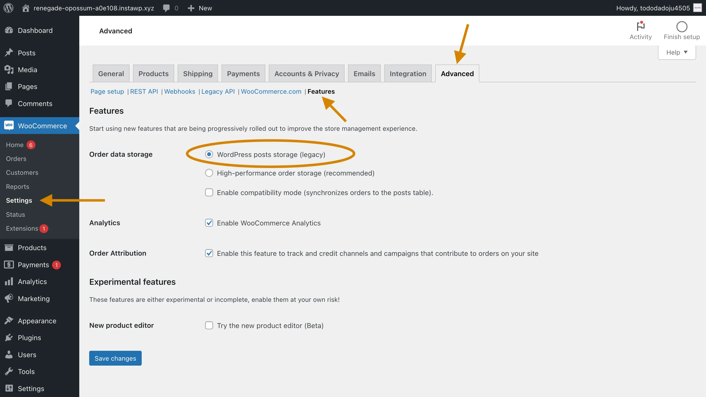

+++
title = 'How to turn off HPOS in WooCommerce'
slug = 'turn-off-hpos-woocommerce'
date = '2024-04-21'
draft = false
summary = 'If a plugin you want to use is not compatible with HPOS, here is how you can disable HPOS.'
+++



	<h2 class="text-gray-50" style="margin-top: 0; margin-bottom: 0.6rem;">Summary</h2>
	
After October 2023, new WooCommerce stores will have High-Performance Order Storage (HPOS) turned on by default. HPOS changes how WooCommerce saves orders in the database—they are no longer saved as WordPress posts and it’s supposed to be faster. However, some plugins might not work with HPOS. If a plugin you want to use is not compatible with HPOS, here is how you can disable HPOS.



## How to turn off HPOS, step-by-step

Turning off HPOS takes just a few clicks.

1.  Under WooCommerce, click **Settings**.
2.  Go to the **Advanced** tab.
3.  Within that page, go to the **Features** section.
4.  Under _Order data storage_, set the setting to **WordPress posts storage (legacy)**.
5.  Click **Save changes**.

## If the setting is unavailable

If your store already has orders, you may need to check the box for **Enable compatibility mode (synchronizes orders to the posts table)** as well click the link that appears below the checkbox to manually start the order sync.

## Can I leave the order sync on?

Most stores shouldn’t have a problem leaving the setting on. If you ever plan on switching back to HPOS, it will allow you change the setting right away. Only the biggest of stores might get slow from all the order snycing, but even then it’s unlikely to cause major issues.

## Still having an issue?

[Email me](mailto:john@getdashify.com) (the author of this post) and I’ll be happy to help you resolve any issue. By helping you, I can document those cases in this post to make it more useful to others.
