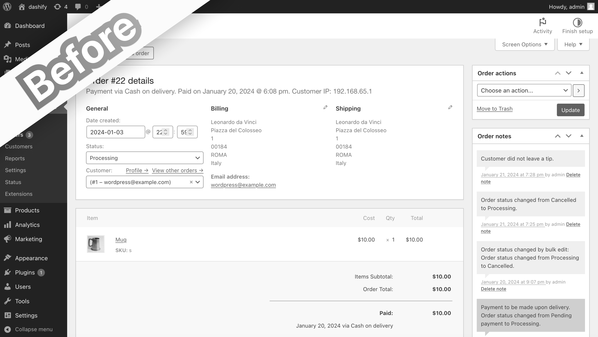
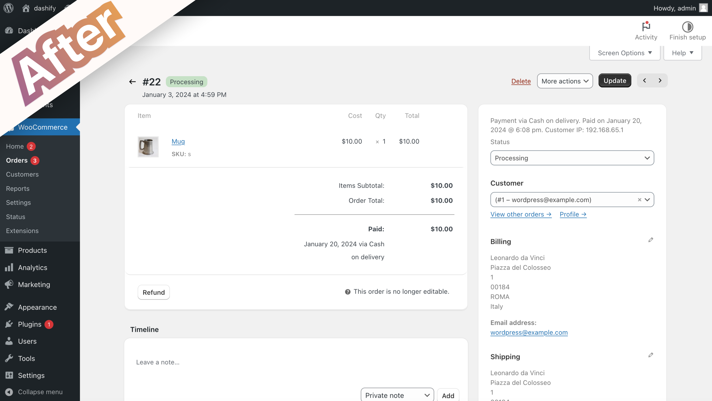
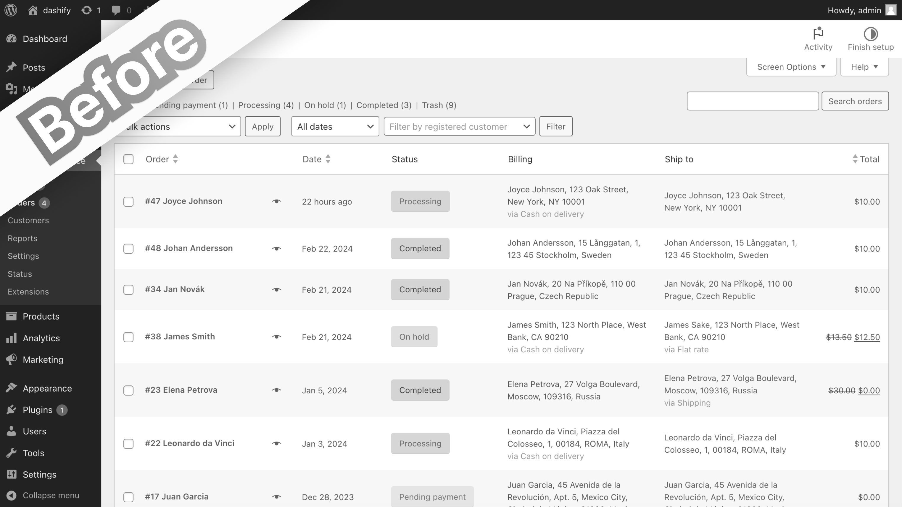
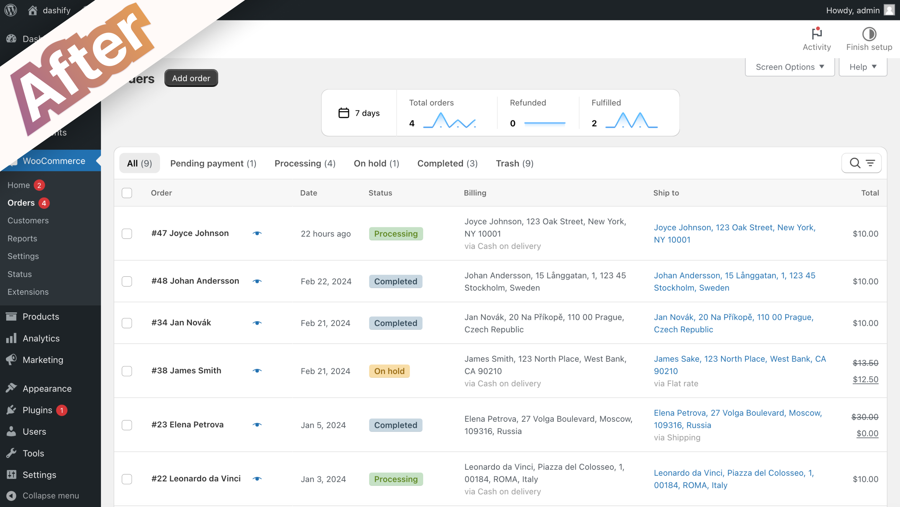
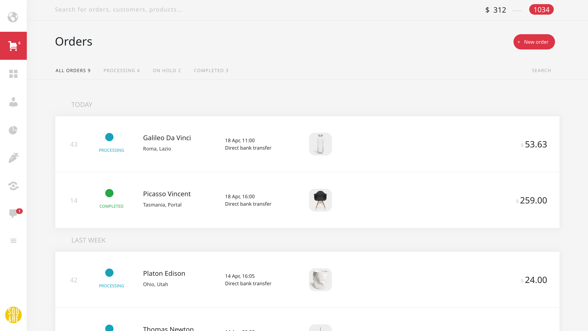

+++
title = 'Alternative to the Energy+ WooCommerce admin theme'
date = '2024-04-18'
draft = false
+++

## Summary



	
<a href="https://codecanyon.net/item/energy-a-beautiful-admin-panel-for-woocommerce/25423023" class="text-gray-50">Energy+</a> is perhaps the only WooCommerce plugin out there that restyles the admin side of WooCommerce: the orders, customers, and everything else a merchant interacts with on the backend. However, that plugin hasn’t been updated in 2 years, doesn’t appear to work with the latest version of WooCommerce, and the author hasn’t responded to support queries for nearly a year after the price went from $30 to an unjustifiable $699.

	
In this post, I’ll talk about an alternative admin theme plugin that I’m creating and how it compares to Energy+.



## What is the alternative?

[Dashify](https://wordpress.org/plugins/dashify/) is a new WordPress plugin that not only adds a fresh theme to the WooCommerce admin order pages, but also introduces new productivity features.

At the moment, Dashify focuses on two of the most important areas in the WooCommerce admin: the order list and the order edit view. It adds new features to both, including small trend graphs above the order list, and previous/next buttons inside the order edit view.

However, a few screenshots will show best what Dashify does.

### Order edit, regular WooCommerce

In the order edit view, the layout isn’t intuitive. The actions buttons are in multiple places, and one has to search for them if they’re new to this screen.

### Order edit, with Dashify

With Dashify, the order action buttons are grouped together and easily found in the top right. The same is true for the order information like order number, date, and status, which are grouped in the top left. Also, the layout is updated slightly to bring key panels to the top and center area, with lesser used panels moved to the sidebar.

### Order list, regular WooCommerce

Perhaps the biggest drawback of the order list is how all the filters and buttons are grouped in the top left, and some like the order status filters are simple text links that are hard to notice. For someone who is familiar, it works, but to someone new, it can be confusing.

### Order list, with Dashify

Dashify makes the possible actions more clear, with the order status filters part of the table, and the searching all together behind a single button.

As you can see, Dashify takes the existing WooCommerce UI and improves the overall look and feel, making it more polished and usable without too drastic changes.

## How is it different from Energy+?

Shown below is what the WooCommerce admin looks like when Energy+ is installed. As you can see, it restyles the whole dashboard.

There are a many differences visually, but the goal of both plugins is the same: to improve the UI and UX of the WooCommerce admin. Here is a list of how Dashify is different:

*   Dashify currently only restyles the order list and view pages.
*   Dashify doesn’t make such significant changes as Energy+ that can be jarring to users already familiar with WooCommerce.
*   Dashify adds new features, like order trend graphs and previous/next order navigation buttons, whereas Energy+ only restyles what is available in WooCommerce.
*   Dashify is offered as a free plugin.

## What are the benefits of Dashify over Energy+?

Why use Dashify over Energy+?

*   Dashify is actively developed, whereas Energy+ appears to have been abandoned for over a year.
*   Dashify is built by an independent developer ready to take your feedback and answer all support requests.
*   Dashify is offered as both a free and paid versions, with the free version having many essential features.
*   The new styles that Dashify introduces to the admin pages are not so much as to confuse an existing merchant, making it a perfect transition to a better WooCommerce experience.
*   Dashify has a big focus on adding new features that improve the workflows in the WooCommerce admin, not just restyling the looks.

## What’s in store for the future of Dashify?

Yes, Dashify doesn’t restyle as much of the WooCommerce admin as Energy+ does, but it’s important to consider that Dashify is actively developed and has a goal of making the whole WooCommerce admin better, starting with the order management.

In the future, Dashify will:

*   continue restyling other pages in the WooCommerce admin.
*   add more features (like order assignment) that are essential to the workflows of many merchants.
*   make the loading time of the WooCommerce admin faster.
*   improve the searching functionality of WooCommerce to quickly search across all orders, customers, products, and other store data.

By trying Dashify today and leaving your feedback (which we actively act upon) you can shape this plugin to be the ultimate addition to your WooCommerce backend, while at the same time benefitting from the improvements it already adds to the WooCommerce order admin pages.
